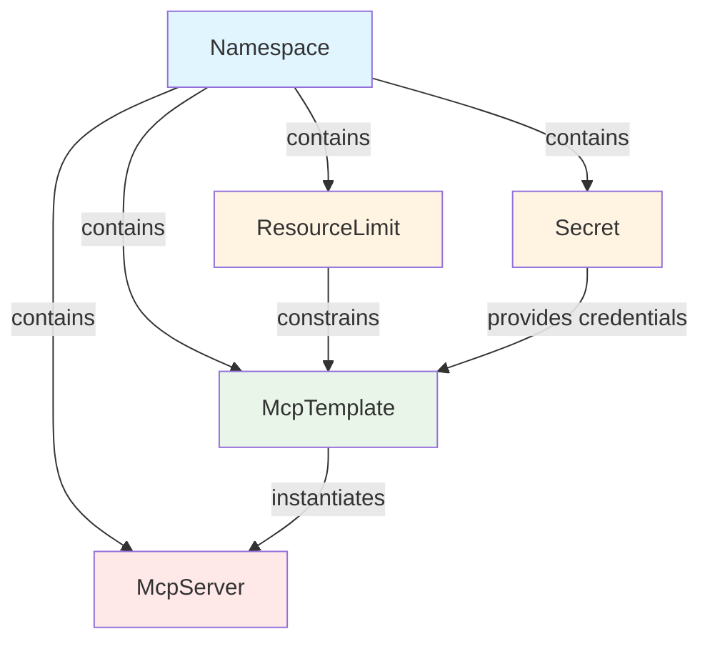

# Resource Dependency Graph

## Dependency Hierarchy



## Deletion Behavior

### Non-Namespace Resources
**모든 리소스 (ResourceLimit, Secret, McpTemplate, McpServer)는 의존성이 완전히 제거될 때까지 삭제가 중단됩니다.**

- **Lease + Finalizer**: 동시성 안전 보장
- **Dependency Check**: 삭제 전 의존성 확인
- **Terminating State**: 의존성 존재 시 리소스는 Terminating 상태로 대기
- **Safe Deletion**: 모든 의존성 제거 후 실제 삭제 완료

**삭제 순서**: `McpServer → McpTemplate → (ResourceLimit, Secret)`

### Namespace (특수 케이스)
**⚠️ Namespace 삭제 시 내부의 모든 리소스가 즉시 삭제됩니다 (Kubernetes 기본 동작).**

- **No Finalizer**: Application-level dependency check만 수행
- **Cascade Delete**: Namespace 삭제 → 모든 하위 리소스 자동 삭제
- **Protection**: 관리되는 리소스가 존재하면 삭제 차단 (선택적)
- **Rationale**: Kubernetes는 Terminating namespace 내 신규 리소스 생성을 차단하므로, 기존 리소스를 보존할 수 없음

## Implementation

| Resource | Lease | Finalizer | Dependency Preserved |
|----------|-------|-----------|---------------------|
| Namespace | ❌ | ❌ | ❌ (Cascade) |
| ResourceLimit | ✅ | ✅ | ✅ |
| Secret | ✅ | ✅ | ✅ |
| McpTemplate | ✅ | ✅ | ✅ |
| McpServer | ✅ | ✅ | ✅ |

**Lease**: `lock-{type}-{namespace}-{name}` (15s, in default namespace)  
**Finalizer**: `mcp-orchestrator.egoavara.net/{resource-type}`
  - Namespace: `mcp-orchestrator.egoavara.net/namespace`
  - ResourceLimit: `mcp-orchestrator.egoavara.net/resource-limit`
  - Secret: `mcp-orchestrator.egoavara.net/secret`
  - McpTemplate: `mcp-orchestrator.egoavara.net/mcp-template`
  - McpServer: `mcp-orchestrator.egoavara.net/mcp-server`

## Example

```bash
# Non-namespace resource: Blocks until dependencies cleared
$ grpcurl -d '{"name": "my-secret", "namespace": "ns"}' ... /DeleteSecret
Error: Cannot delete - has dependencies: Pod abc, Template xyz

# Namespace: Deletes everything immediately
$ grpcurl -d '{"name": "ns"}' ... /DeleteNamespace
Success: Namespace and ALL resources deleted
```
