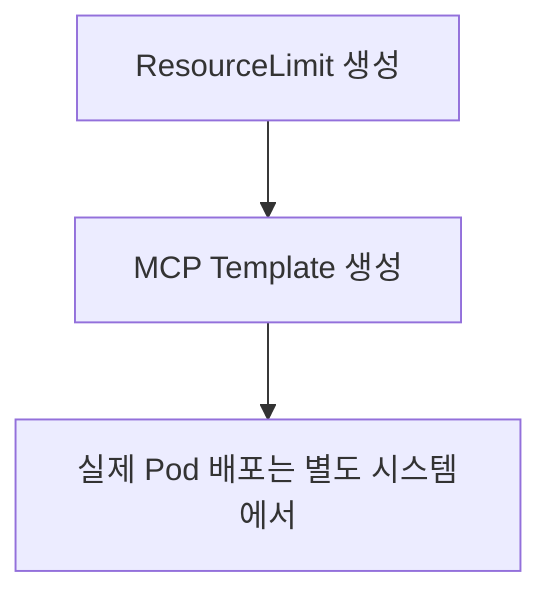

# MCP Orchestrator API (Protocol Buffers v3)

MCP Orchestrator의 gRPC API 정의입니다. Kubernetes에서 MCP 서버 인스턴스를 생성하기 위한 **템플릿/설정 관리** 서비스를 제공합니다.

> **중요:** 이 API는 실제 Pod를 생성/관리하는 것이 아니라, **Pod 생성에 필요한 템플릿과 설정만 관리**합니다.

## 📁 파일 구조

```
/spec/                        # 프로젝트 루트
├── common.proto              # 공통 타입 정의
├── mcp_template.proto        # MCP Template 리소스 (Pod 생성 스펙)
├── mcp_server.proto          # MCP Server 리소스 (조회 전용)
├── namespace.proto           # Namespace 리소스
├── secret.proto              # Secret 리소스
├── resource_limit.proto      # ResourceLimit 리소스 (볼륨 포함)
└── service.proto             # gRPC 서비스 정의
```

> **위치:** 이 spec 디렉토리는 backend, frontend 등 여러 컴포넌트에서 공유됩니다.

## 🎯 리소스 개요

### 1. MCP Template
MCP 서버 인스턴스를 생성하기 위한 템플릿 명세

**주요 작업:**
- `CreateMcpTemplate` - 새 MCP 템플릿 생성
- `GetMcpTemplate` - 템플릿 정보 조회
- `ListMcpTemplates` - 템플릿 목록 조회 (필터링/페이지네이션 지원)
- `DeleteMcpTemplate` - 템플릿 삭제

**특징:**
- Pod 생성에 필요한 모든 설정 포함 (image, command, args, env_vars, resources)
- ResourceLimit 참조로 리소스 지정
- **실제 Pod 상태 정보는 포함하지 않음**

### 2. Namespace
Kubernetes Namespace 관리

**주요 작업:**
- `CreateNamespace` - Namespace 생성
- `GetNamespace` - Namespace 조회
- `ListNamespaces` - Namespace 목록 조회
- `DeleteNamespace` - Namespace 삭제

### 3. Secret
Kubernetes Secret 관리

**주요 작업:**
- `CreateSecret` - Secret 생성
- `GetSecret` - Secret 조회
- `ListSecrets` - Secret 목록 조회
- `UpdateSecret` - Secret 업데이트 (전략 선택 가능)
- `DeleteSecret` - Secret 삭제

**업데이트 전략:**
- `REPLACE` - 전체 데이터 교체
- `MERGE` - 기존 키 유지하며 새 키 추가
- `PATCH` - 명시된 키만 수정/추가

**보안:**
- Secret 데이터는 직접 반환하지 않음
- 키 목록만 `keys` 필드로 제공

### 4. ResourceLimit
사전 정의된 리소스 프리셋 (GCP 머신 타입과 유사)

**주요 작업:**
- `CreateResourceLimit` - 리소스 프리셋 생성
- `GetResourceLimit` - 프리셋 조회
- `ListResourceLimits` - 프리셋 목록 조회
- `DeleteResourceLimit` - 프리셋 삭제 (강제 삭제 옵션)

**특징:**
- `n1-standard-nano` 같은 이름으로 리소스 정의
- `usage_count`로 사용 중인 템플릿 수 추적
- CPU/메모리 request와 limit 별도 설정 가능

## 🔧 공통 타입

### EnvVar
```protobuf
message EnvVar {
  string name = 1;
  string value = 2;
}
```

### ResourceRequirements
```protobuf
message ResourceRequirements {
  string cpu = 1;      // e.g., "100m", "500m", "1"
  string memory = 2;   // e.g., "256Mi", "512Mi", "1Gi"
}
```

### ResourceLimit
```protobuf
message ResourceLimit {
  string cpu = 1;
  string memory = 2;
  optional string cpu_limit = 3;
  optional string memory_limit = 4;
  optional string ephemeral_storage = 5;
}
```

### SecretType (Enum)
```protobuf
enum SecretType {
  SECRET_TYPE_UNSPECIFIED = 0;
  SECRET_TYPE_OPAQUE = 1;
  SECRET_TYPE_DOCKER_CONFIG_JSON = 2;
  SECRET_TYPE_BASIC_AUTH = 3;
  SECRET_TYPE_SSH_AUTH = 4;
  SECRET_TYPE_TLS = 5;
}
```

## 📖 사용 예시

### 1. ResourceLimit 생성 및 사용

```json
// 1. ResourceLimit 생성
{
  "name": "n1-standard-nano",
  "display_name": "Nano Tier",
  "description": "Small MCP server instances",
  "limits": {
    "cpu": "100m",
    "memory": "256Mi",
    "cpu_limit": "200m",
    "memory_limit": "512Mi"
  }
}

// 2. MCP Template에서 ResourceLimit 참조
{
  "name": "my-memory-server",
  "image": "node:24-alpine3.21",
  "command": ["npx"],
  "args": ["-y", "@modelcontextprotocol/server-memory"],
  "resource_limit_name": "n1-standard-nano",
  "namespace": "default",
  "env_vars": [
    {"name": "NODE_ENV", "value": "production"}
  ],
  "labels": {
    "app": "mcp-server",
    "env": "prod"
  }
}
```

### 2. Secret 생성 및 업데이트

```json
// 생성
{
  "name": "db-credentials",
  "namespace": "default",
  "data": {
    "username": "YWRtaW4=",  // base64("admin")
    "password": "cGFzc3dvcmQ="   // base64("password")
  },
  "type": "SECRET_TYPE_OPAQUE"
}

// 업데이트 (PATCH 전략)
{
  "name": "db-credentials",
  "namespace": "default",
  "data": {
    "api_key": "bmV3LWFwaS1rZXk="  // 새 키만 추가
  },
  "strategy": "SECRET_UPDATE_STRATEGY_PATCH"
}
```

### 3. 페이지네이션 사용

```json
// 첫 페이지 요청
{
  "page_size": 10,
  "page_token": ""
}

// 응답
{
  "templates": [...],
  "next_page_token": "eyJvZmZzZXQiOjEwfQ==",
  "total_count": 45
}

// 다음 페이지 요청
{
  "page_size": 10,
  "page_token": "eyJvZmZzZXQiOjEwfQ=="
}
```

### 4. 라벨 셀렉터로 필터링

```json
{
  "label_selector": {
    "app": "mcp-server",
    "env": "prod"
  },
  "page_size": 20
}
```

## 🎨 설계 패턴

### 응답에 메타 정보 포함
- `created_at`: Unix timestamp (int64)
- `usage_count`: 사용 중인 리소스 수

## 🔐 보안 고려사항

1. **Secret 데이터 노출 방지**
   - Secret 조회 시 실제 데이터는 반환하지 않음
   - 키 목록만 제공하여 존재 여부 확인 가능

2. **ResourceLimit 삭제 보호**
   - 사용 중인 ResourceLimit 삭제 시 `referenced_templates_count` 반환
   - `force=true` 옵션으로 강제 삭제 가능

3. **Namespace 격리**
   - MCP Template과 Secret은 namespace 단위로 관리
   - ResourceLimit은 클러스터 레벨 리소스

## 🚀 워크플로우 예시

### 전체 워크플로우: 리소스 프리셋 → MCP 템플릿



1. **ResourceLimit 생성** (`n1-standard-nano`)
2. **MCP Template 생성** (ResourceLimit 참조)
3. **실제 Pod 배포** (이 API 범위 밖 - K8s Controller가 담당)

## 📚 다음 단계

- [ ] gRPC 서버 구현 (Rust/tonic)
- [ ] gRPC 클라이언트 SDK 생성
- [ ] HTTP/REST Gateway 추가 (grpc-gateway)
- [ ] OpenAPI 스펙 생성
- [ ] 인증/인가 레이어 추가
- [ ] MCP Template → 실제 Pod 배포 Controller 구현
- [ ] MCP Server 조회 API 구현 (Pod 상태 조회)
